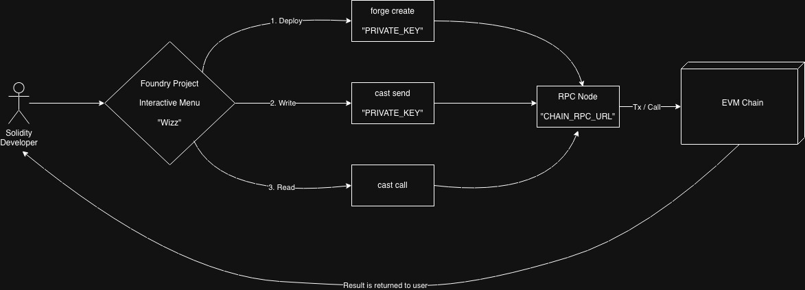

# Foundry-Wizard

## Introduction

This Rust crate is an interactive CLI wrapper around Foundry's commands. Instead of:

- Memorising flags and piecing together long terminal commands
- Writing deploy scripts
- Leaving your terminal to find tedious ways of interacting with your on-chain contracts

Foundry-Wizard walks you through deploying, writing and reading Solidity smart contracts through a step-by-step menu.

## Links

[Foundry Book](https://www.getfoundry.sh/) - the toolkit this project wraps

[Tutorial Video](https://youtube.com) - coming soon

## Getting Started

1. Install: cargo install foundry-wizard

2. Navigate to your foundry project

3. Rename .env.example to .env and fill in your RPC URL and private key.

4. Add your .env in your .gitignore

5. Run foundry-wizard in your terminal

## How it works

Foundry Wizard reads your .env file with the specific variables names of "CHAIN_RPC_URL" and "PRIVATE_KEY", then presents the developer with three options:

Deploy - Scans your "src/" folder for .sol files and lets you pick a contract and constructs a forge create command with the correct flags and constructor arguments if needed. Returns with transaction hash, deployer address and contract address.

Write & Read — Both prompt for a contract address, match it to a contract in your src/ folder, read the ABI, and display the relevant functions. Write shows state-changing functions and submits via cast send; Read shows view functions and queries via cast call. Returns the details of the transaction / call

## Security

Foundry-Wizard does not store, transmit or log your private key or RPC URL. It reads the two variables from your .env file and passes them directly to Foundry's commands — no network requests are made by the tool itself, only by Foundry.

Make sure your .env is listed in .gitignore to avoid accidentally committing sensitive keys.

## Architecture Diagram

## Tests
